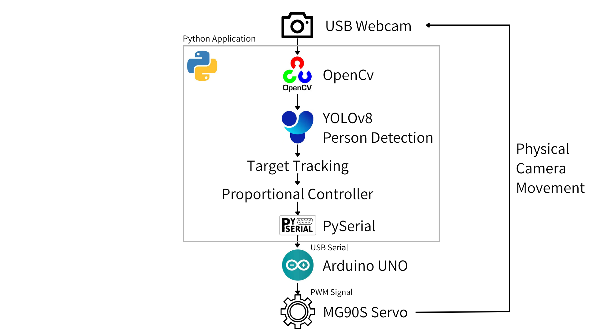
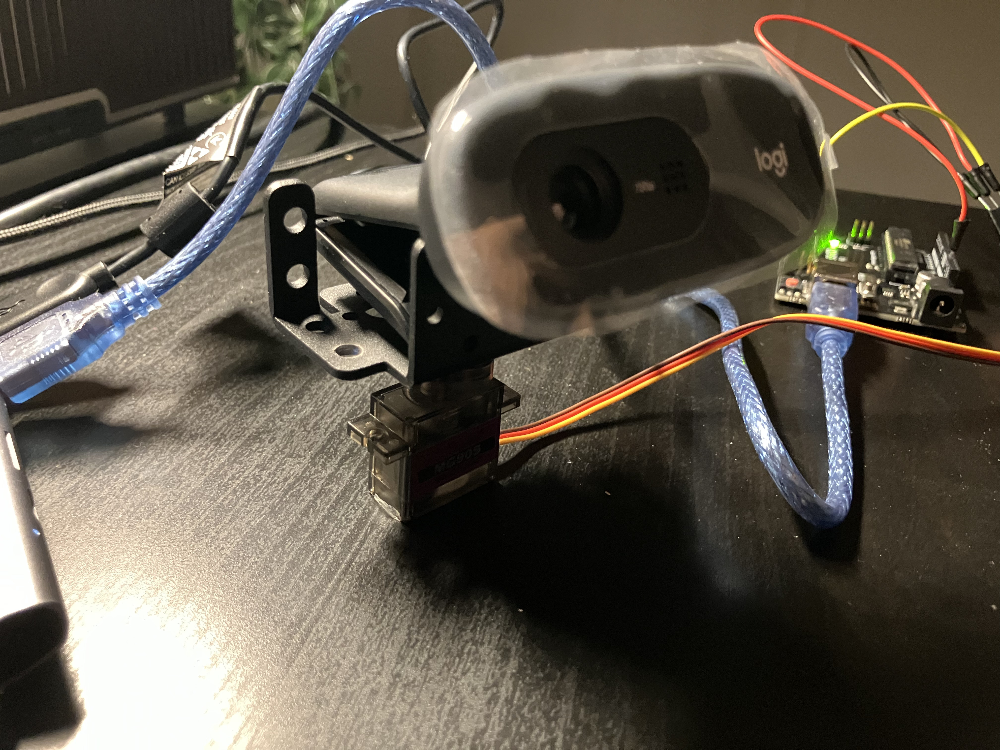
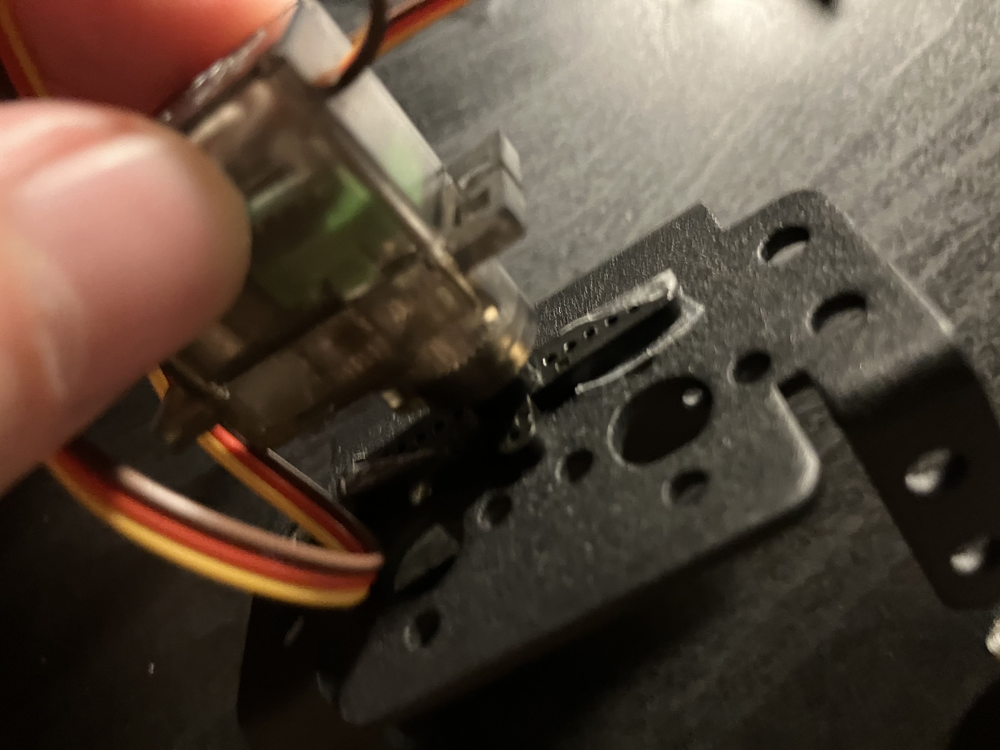
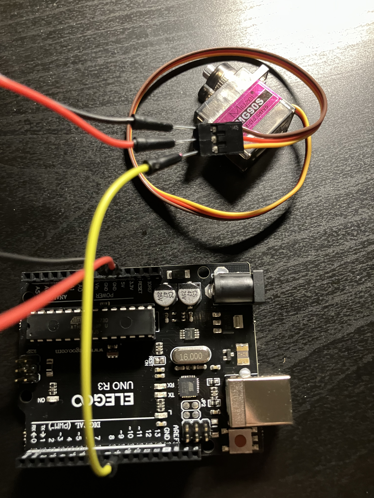

# AI Vision Tracker


Real-time AI-powered robotic tracking system that combines computer vision, embedded systems, and hardware actuation to physically track detected targets using YOLOv8, OpenCV, Arduino, and servo-controlled motion.

---

## Overview

The system performs real-time person detection using YOLOv8 and OpenCV, calculates target position relative to the camera center, and converts tracking error into servo control commands that physically rotate the camera platform.

The project integrates:

* AI inference
* computer vision
* real-time processing
* serial communication
* embedded systems
* robotic actuation
* closed-loop control systems

---

## Features

* Real-time person detection using YOLOv8
* Intelligent target selection
* Bounding box and target center tracking
* Exponential smoothing for tracking stability
* AI-controlled servo motor actuation
* Python ↔ Arduino serial communication
* Real-time webcam processing
* Closed-loop horizontal tracking system
* FPS monitoring and runtime diagnostics

---

## System Architecture



---

## Hardware Prototype

### Mounted Webcam



The USB webcam is mounted on a servo-actuated pan assembly that physically rotates in response to AI-generated tracking commands.

### Bracket Assembly



The pan mechanism uses an MG90S servo motor and a prototype bracket assembly. During development, mechanical compatibility issues required an alternative horn-to-bracket coupling solution to validate rotational tracking.

### Wiring



The Arduino Uno receives servo angle commands from the Python application through USB serial communication and generates PWM signals to control the MG90S servo motor.

---

## Tech Stack

### Software

* Python
* OpenCV
* YOLOv8
* Ultralytics
* PySerial

### Hardware

* Arduino Uno
* MG90S Servo Motor
* USB Webcam
* Pan Rotation Bracket
* Breadboard + Jumper Wires

---

## Installation

```bash
pip install -r requirements.txt
```

---

## Run

### AI Tracking

```bash
python src/ai_servo_tracking.py
```

### Manual Servo Testing

```bash
python src/serial_test.py
```

---

## Engineering Concepts Explored

* Computer vision inference
* Real-time frame processing
* Embedded systems integration
* PWM servo control
* Serial communication
* Closed-loop control systems
* Hardware/software interaction
* Robotics prototyping
* Motion smoothing and stability tuning

---

## Current Limitations

* Single-axis pan tracking only
* CPU-based inference (~8 FPS)
* Prototype mechanical coupling
* Tracking motion still requires tuning for smoother actuation

---

## Future Improvements

* Dual-axis pan-tilt tracking
* PID control implementation
* Raspberry Pi edge deployment
* GPU acceleration / TensorRT optimization
* Multi-object tracking
* Autonomous target prediction
* ROS2 integration
* Permanent mechanical mounting system
* External servo power distribution

---

## Repository Structure

```txt
src/        → Python computer vision and tracking logic
arduino/    → Arduino servo control firmware
docs/       → Development logs and architecture notes
assets/     → Demo videos and hardware photos
```