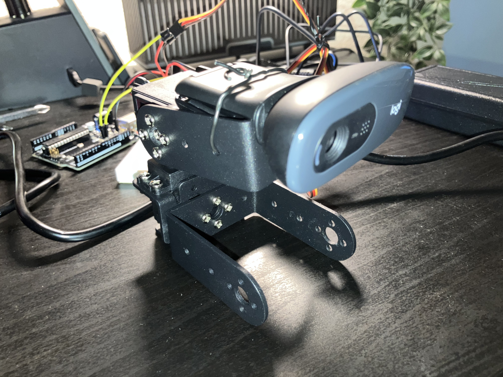
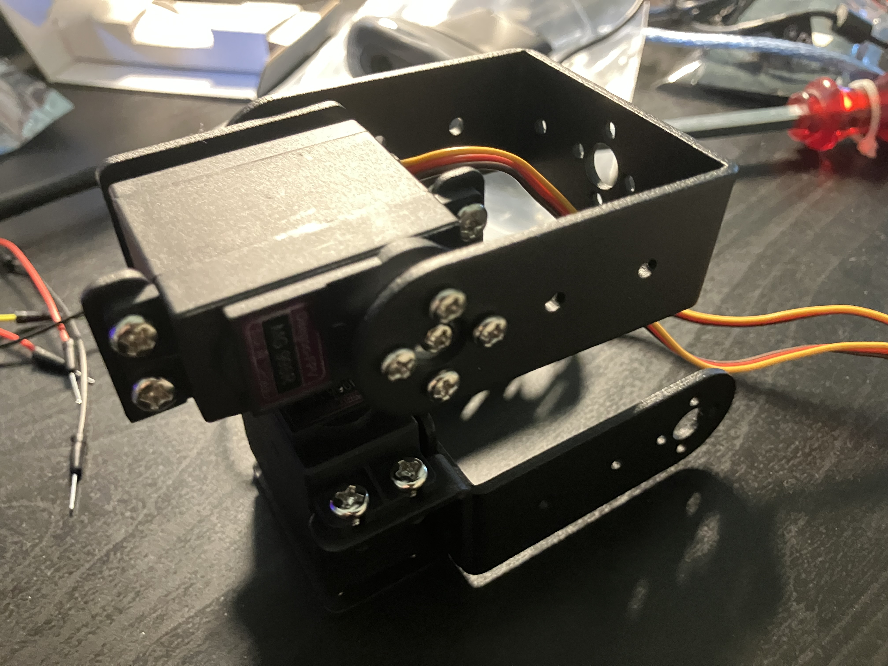
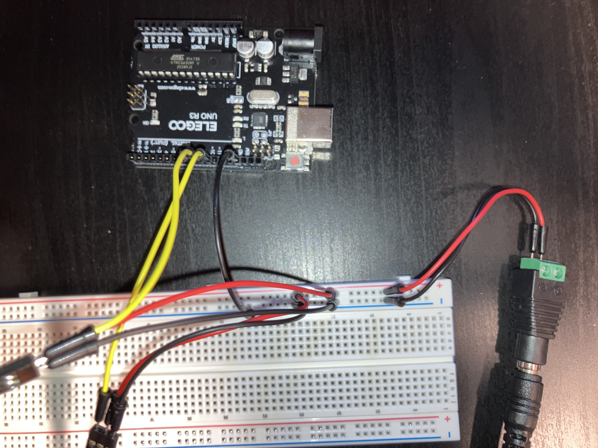

# AI Vision Tracker


Real-time AI-powered robotic tracking system that combines computer vision, embedded systems, and hardware actuation to physically track detected targets using YOLOv8, OpenCV, Arduino, and servo-controlled motion.

---

## Overview

The system performs real-time person detection using YOLOv8 and OpenCV, calculates target position relative to the camera center, and converts tracking error into servo control commands that physically rotate the camera platform.

The project integrates:

* AI inference
* computer vision
* real-time processing
* serial communication
* embedded systems
* robotic actuation
* closed-loop control systems

---

## Features

* Real-time person detection using YOLOv8
* Intelligent target selection
* Bounding box and target center tracking
* Exponential smoothing for tracking stability
* Dual-axis pan-tilt camera tracking
* Proportional control-based servo actuation
* Python ↔ Arduino serial communication
* Real-time webcam processing
* Closed-loop visual tracking system
* FPS monitoring and runtime diagnostics

---

## System Architecture


---

## Hardware Prototype

### Mounted Webcam



The USB webcam is mounted on a dual-axis pan-tilt platform actuated by MG996R servos and controlled through a real-time AI tracking pipeline.

### Bracket Assembly



The pan-tilt assembly uses dual MG996R high-torque servos and a dedicated external power supply to support webcam load and dual-axis tracking.

### Wiring



The Arduino Uno receives pan and tilt angle commands from the Python application through USB serial communication and generates PWM signals for dual MG996R servo control.

---

## Runtime Performance

| Metric | Value |
|----------|----------|
| Average FPS | ~15 |
| Peak FPS | ~20 |
| Webcam Resolution | 640×480 |
| YOLO Inference Resolution | 320×320 |

Performance improvements were achieved by reducing YOLO inference resolution while maintaining acceptable person detection accuracy.

---

## Tech Stack

### Software

* Python
* OpenCV
* YOLOv8
* Ultralytics
* PySerial

### Hardware

* Arduino Uno
* 2× MG996R High-Torque Servos
* USB Webcam
* Pan-Tilt Bracket Assembly
* 5V 5A External Power Supply
* Breadboard + Jumper Wires

---

## Installation

```bash
pip install -r requirements.txt
```

---

## Run

### AI Tracking

```bash
python src/ai_servo_tracking.py
```

### Manual Servo Testing

```bash
python src/serial_test.py
```

---

## Engineering Concepts Explored

* Computer vision inference
* Real-time frame processing
* Embedded systems integration
* PWM servo control
* Serial communication
* Closed-loop control systems
* Hardware/software interaction
* Robotics prototyping
* Motion smoothing and stability tuning
* Proportional control
* Power distribution for embedded systems
* Mechanical constraint management
* Pan-tilt robotics systems

---

## Current Limitations

* CPU-based inference (~15 FPS average, ~20 FPS peak)
* Person detection only
* Proportional control only (PID not yet implemented)
* Limited tracking range due to mechanical safety constraints

---

## Future Improvements

* PID control implementation
* Raspberry Pi edge deployment
* GPU acceleration / TensorRT optimization
* Multi-object tracking
* Autonomous target prediction
* ROS2 integration
* Face tracking
* Object re-identification
* Remote telemetry dashboard

---

## Repository Structure

```txt
src/        → Computer vision, tracking, and control logic
arduino/    → Arduino pan-tilt control firmware
docs/       → Development logs, architecture, and wiring diagrams
assets/     → Demo videos, GIFs, and hardware photos
```